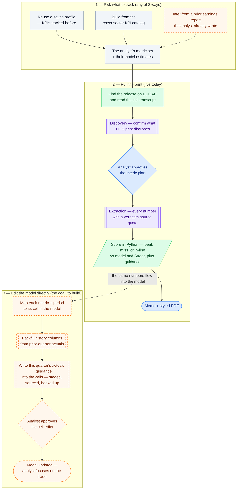

# earnings-summary

**A reusable, profile-driven [Claude Code](https://claude.com/claude-code) skill that turns a company's quarterly earnings release and call transcript into a structured buy-side memo — with the beat/miss math done deterministically in Python and a verbatim source quote behind every number.**

An analyst invokes it as `/earnings-summary`, answers a short intake (company, quarter, which analyst), and gets back a markdown memo (and a styled PDF) with a scorecard, financial summary, guidance changes, custom KPIs, and call highlights. It is built so the AI does the *reading and drafting* while Python does the *arithmetic and provenance* — the parts you can't afford to get subtly wrong.

> **Origin.** This is one skill extracted, self-contained, from a private multi-skill buy-side research toolkit. References to "the suite" elsewhere in the docs point back to that larger project.

---

## How it works

The skill runs as a three-phase flowchart: **① pick what to track** (any of three ways), **② pull the print** (live today), and **③ edit the model directly** (the goal, still to build). Whichever way the analyst picks their metrics, everything converges into updating their model — so their earnings-day busywork is automated and they can focus on the trade. Node color marks the trust boundary (the AI *drafts*, Python *computes*); amber + dashed marks what's still to build.



🔵 **Analyst** (in the loop) · 🟣 **AI agent** — reads & proposes, *always reviewed* · 🟢 **Deterministic Python** — the math, *never the model* · ⚪ **Data** · 🟧 **To build** — dashed

The trust boundary is the whole point: the language model is good at *reading* a messy press release and *drafting* prose, and bad at *not quietly miscomputing a percentage*. So every number is computed by `compute_beat_miss.py` / `reconcile_guidance.py`, and the agent pastes those tables verbatim — it is structurally prevented from re-typing a figure.

**Where it's headed.** Two pieces are still to build (amber, dashed). First, a third way to pick metrics: if the analyst already wrote an earnings report for this name, parse it to infer the KPIs and line items they track — the strongest signal of what they care about, since they've already shown it. Second, the payoff — **editing the model directly**: map each tracked metric and period to its cell, backfill the history columns from the prior releases the skill already fetches, and write this quarter's actuals + new guidance into the cells (highlighted, source-quoted, staged on a backed-up copy for approval). Same propose → approve → write discipline throughout, so however the metrics get chosen, the flow ends in an updated model and the analyst's attention goes to the trade.

---

## What makes it trustworthy

These are the design rules, and they map directly to how a real research process has to behave:

- **The math is deterministic.** Beat/miss verdicts and every delta come out of Python, not the model. The memo never depends on an LLM doing arithmetic.
- **Two benchmarks, always.** Each metric is scored against the analyst's *own model* **and** *Street consensus*. Buy-side cares about "vs my number" and "vs the Street," so both columns are always shown.
- **Provenance travels with every value.** Each extracted figure carries its source and a verbatim quote; each call highlight is quoted and attributed. A metric the company didn't disclose is recorded **absent — never filled, never interpolated.**
- **Propose, then approve.** A discovery pass reads *this specific print* and proposes which metrics it discloses plus any company-specific KPIs the catalog is missing. Nothing is tracked or persisted until the analyst confirms.
- **Config, not code.** An analyst's KPIs and model estimates live in a small YAML profile that *overlays* a cross-sector KPI catalog. Covering a new sector or analyst is a config change, not new code — and catalog improvements flow through automatically.

---

## A worked example

Two real prints are included end-to-end in [`examples/`](examples/) (rendered markdown + the styled PDF):

- **[Norwegian Cruise Line (NCLH), Q1 2026](examples/NCLH_Q12026_earnings.md)** — exercises the full path, including multi-quarter guidance lineage and company-specific KPIs (net yield, net cruise cost ex-fuel) surfaced by discovery for a sector the catalog only loosely covers.
- **[Salesforce (CRM), FY27 Q1](examples/CRM_FY27Q1_earnings.md)** — the model-less path (actuals + YoY only) on a clean SaaS print with a guidance raise and a large buyback.

A slice of the NCLH scorecard the script produced (the empty consensus columns are dropped here for width):

> **Bottom line:** A "good quarter, worse year" print — NCLH beat Q1 on cost discipline and below-the-line items, but **cut FY26 guidance** on softer Europe/Middle East demand; the cost offset and a still-elevated 5.3x net leverage frame the debate.

| Metric | Actual | My Est | Δ vs Est | YoY | Read |
|---|---|---|---|---|---|
| Total Revenue | $2,331M | $2,250M | +3.6% | +9.6% | **BEAT** |
| Operating Margin (GAAP) | 10.0% | 9.5% | +0.49pp | +0.55pp | IN-LINE |
| Adjusted EPS (non-GAAP, diluted) | $0.23 | $0.16 | +0.07 (+43.8%) | +130.0% | **BEAT** |
| Adjusted EBITDA (non-GAAP) | $533M | $515M | +3.5% | +17.6% | **BEAT** |
| Net Leverage (Net Debt / TTM EBITDA) | 5.30x | 5.10x | +3.9% | — | **MISS** |

*The "My Est" values in the NCLH example are illustrative synthetic inputs used to exercise the pipeline end-to-end — clearly flagged as such in the memo. Every **actual**, YoY figure, guidance number, and quote is real and traced to the SEC filing.*

Each memo always contains the same standard sections: bottom-line one-liner, TL;DR, scorecard (Actual vs Model vs Street), financial summary, guidance changes with a raise/cut/maintain action, the analyst's custom KPIs, management commentary & Q&A highlights, and watch items / thesis impact.

---

## Quick start

Requires **Python 3.9+**.

```bash
python3 -m venv .venv && source .venv/bin/activate
pip install -r requirements.txt
```

The skill is normally driven by Claude Code (`/earnings-summary`), but every deterministic piece is a plain CLI you can run on its own. These all work standalone:

```bash
# Validate the cross-sector KPI catalog (structural + shared-key consistency)
python scripts/validate_catalog.py

# Resolve an analyst profile into its final KPI list (this one -> [crpo, rpo])
python scripts/resolve_kpis.py --profile profiles/demo.yaml

# Locate a company's latest earnings 8-K / Exhibit 99.1 on EDGAR (live, stdlib only)
python scripts/find_edgar_release.py --ticker CRM

# Run the deterministic-math test suites
python tests/test_beat_miss.py
python tests/test_reconcile_guidance.py
```

To create a new analyst, copy [`profiles/_example.yaml`](profiles/_example.yaml) (a fully annotated schema) to `profiles/<your-slug>.yaml` and edit. The full step-by-step runbook lives in **[`SKILL.md`](SKILL.md)**.

---

## What's in here

| Path | What it is |
|---|---|
| `SKILL.md` | The authoritative spec + 9-step runbook the agent follows. |
| `kpi_catalog.yaml` | Cross-sector KPI scaffold: 9 sectors × ~47 metrics, each with aliases / unit / direction / extraction hint, plus per-sector call-highlight themes. |
| `profiles/_example.yaml` | Annotated analyst-profile schema (copy to create one). |
| `profiles/demo.yaml` | A worked SaaS-coverage profile (overlays the catalog, picks cRPO + RPO). |
| `scripts/find_edgar_release.py` | Locate the earnings 8-K (Item 2.02) / Ex-99.1 on EDGAR from a ticker or name; can resolve prior quarters for guidance lineage. |
| `scripts/fetch_url.py` | Fetch SEC URLs with the required fair-access User-Agent. |
| `scripts/extract_pdf_text.py` | PDF → page-tagged text (transcript, or a release given as PDF). |
| `scripts/resolve_kpis.py` | Resolve a profile against the catalog into the flat KPI list + prompt blocks. |
| `scripts/compute_beat_miss.py` | **Deterministic** beat/miss + delta math; renders the scorecard tables. |
| `scripts/reconcile_guidance.py` | **Deterministic** multi-document guidance lineage across quarters. |
| `scripts/render_pdf.py` | Render the finished memo to a styled, color-coded PDF (`reportlab`). |
| `scripts/validate_catalog.py` | Structural + shared-key consistency checks on the catalog. |
| `*_prompt.md`, `memo_template.md` | Prompt templates for the discovery/extraction/guidance agents + the fixed memo skeleton. |
| `lib/pdf_lib.py` | PDF text-extraction + rendering primitive. |
| `tests/` | Unit tests for the deterministic math + profile-resolution fixtures. |
| `examples/` | Two real prints run end-to-end (markdown + PDF). |

---

## Limitations

Stated plainly, because honest scoping is part of the point:

- **Consensus is manual.** There's no licensed consensus feed; beat/miss vs Street is only as good as the numbers the analyst pastes (and their period/basis must match the actuals).
- **No paywall bypass.** IR pages and transcript hosts are often JS-heavy or gated; the skill falls back to a pasted PDF or text.
- **Scope is the press release + the call.** No 10-Q/10-K footnote ingestion yet; no charts/figures are parsed (text and tables only).
- **Guidance lineage is only as deep as the prior releases you supply.** If a live guide was set before the oldest release provided, the reconciler flags it (`needs_more_history`) rather than guessing.
- **EDGAR can throttle** automated lookups; fall back to a pasted BamSEC/EDGAR link.
- **One company per run.**

---

## Tech stack

Python 3.9 · `pdfplumber` + `pypdfium2` (PDF) · `reportlab` (PDF rendering) · `pyyaml` · the SEC EDGAR submissions API · authored as a Claude Code skill.

## License

[MIT](LICENSE)
